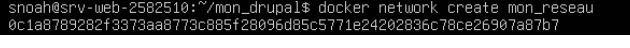
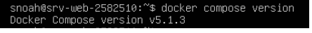
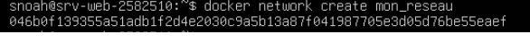
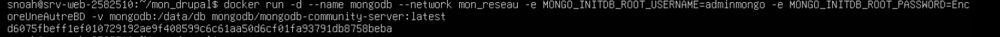
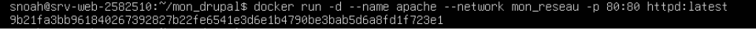
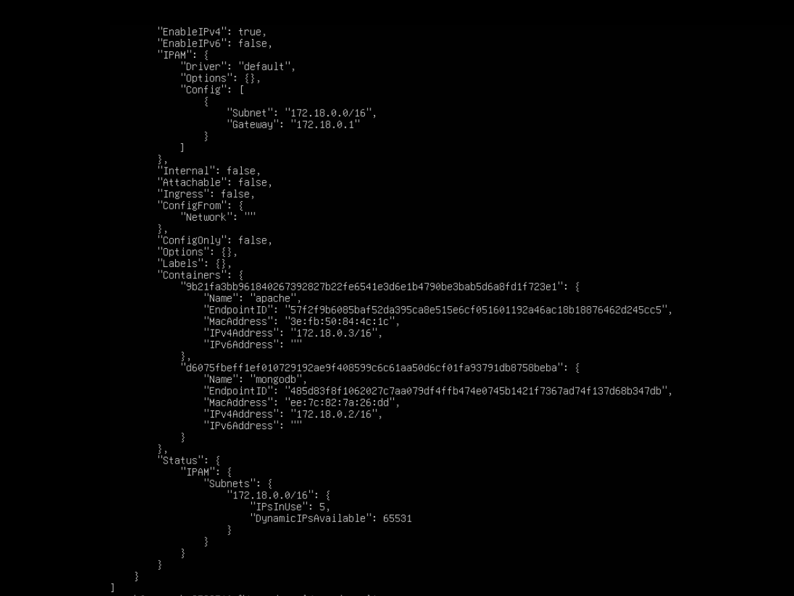
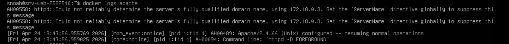

# ISS_TP2_Serge_Noah_2582510
# Travail pratique 2 - Docker

<br></br>
### But du travail : Dans ce travail pratique, nous allons démontrer que nous avons installé un système de conteneurs et que nous sommes capable de créer des conteneurs selon une description.

Principalement, nous allez faire :

l'installation d'un système de conteneur en respectant la procédure et les recommandations du manufacturier au besoin;
configurer le système de conteneurs en fonction d’une utilisation sécuritaire;
vérifier que les éléments installés fonctionnent comme prévu;
configurer des règles de gestions des accès sécuritaires.
<br></br>


# Section 1 : Vérification et conteneurs

## Étape 1: Vérification de l’installation

Verification de l’installation des deux composantes Docker vous : Docker Engine et Docker Compose.

####  Entrez les commandes suivantes sur votre serveur : 
####  Commandes de verification

```bash
docker version
```

<details>
    <summary> <strong>Detail image :</strong></summary>
  
</details>

```bash
docker compose version
```

<details>
    <summary> <strong>Detail image :</strong></summary>
  
</details>

## Étape 2 : Création de conteneurs sur le poste local

<strong>Objectifs:</strong>
- Créer un système avec un réseau privé virtuel mon_reseau et les conteneurs apache avec l'image httpd:latest et mongodb avec l'image mongodb/mongodb-community-server`.
- Le conteneur httpd écoutera sur le port 80 de votre hôte.
- L’utilisateur root de mongoDB sera adminmongo et le mot de passe sera EncoreUneAutreBD.
- Le conteneur mongodb utilisera le volume mongodb.


#### Commande pour créer le réseau privé

```bash
docker network create mon_reseau
```

<details>
    <summary> <strong>Detail image :</strong></summary>
  
</details>

#### Commande pour créer le volume MongoDB

```bash
docker volume create mongodb
```

<details>
    <summary> <strong>Detail image :</strong></summary>
  
</details>

#### Commande pour lancer MongoDB

```bash
docker run -d \
--name mongodb \
--network mon_reseau \
-e MONGO_INITDB_ROOT_USERNAME=adminmongo \
-e MONGO_INITDB_ROOT_PASSWORD=EncoreUneAutreBD \
-v mongodb:/data/db \
mongodb/mongodb-community-server:latest
```

<details>
    <summary> <strong>Detail image :</strong></summary>
  
</details>

#### Commande pour lancer APACHE(HTTPD)

```bash
docker run -d \
--name apache \
--network mon_reseau \
-p 80:80 \
httpd:latest
```

<details>
    <summary> <strong>Detail image :</strong></summary>
  
</details>

#### Commande pour vérifier le réseau :

```bash
docker network inspect mon_reseau
```

<details>
    <summary> <strong>Detail image :</strong></summary>
  
</details>

#### Commande pour vérifier les logs Apache :

```bash
docker logs apache
```

<details>
    <summary> <strong>Detail image :</strong></summary>
  
</details>
