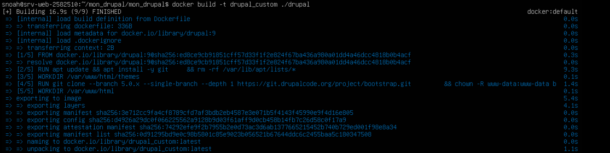
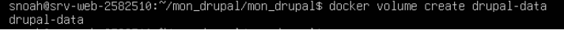
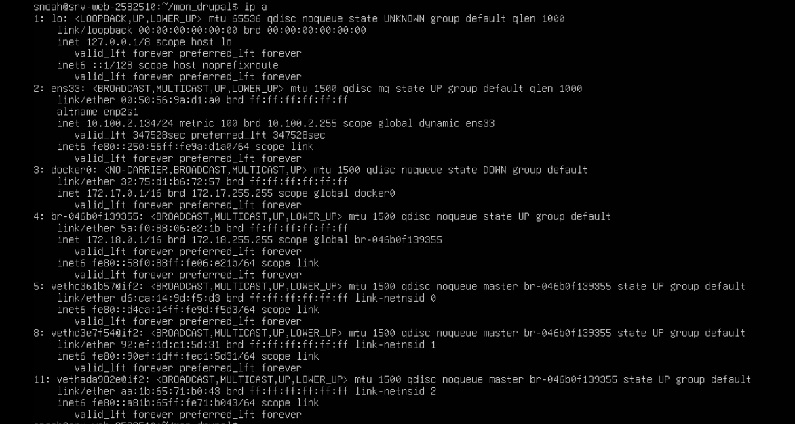
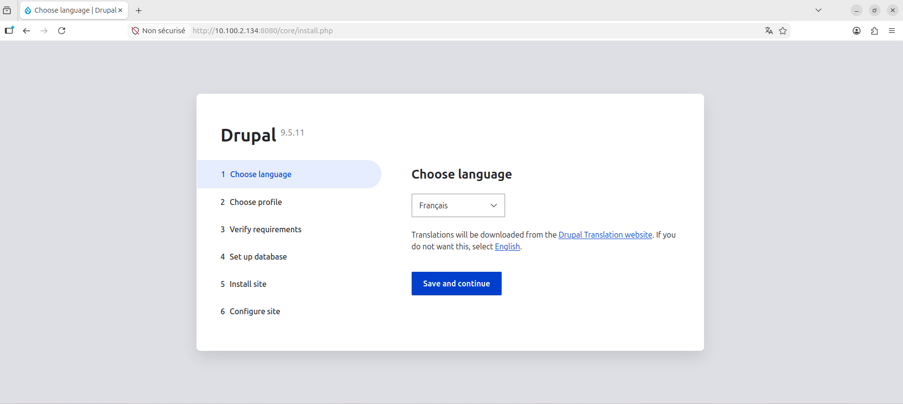
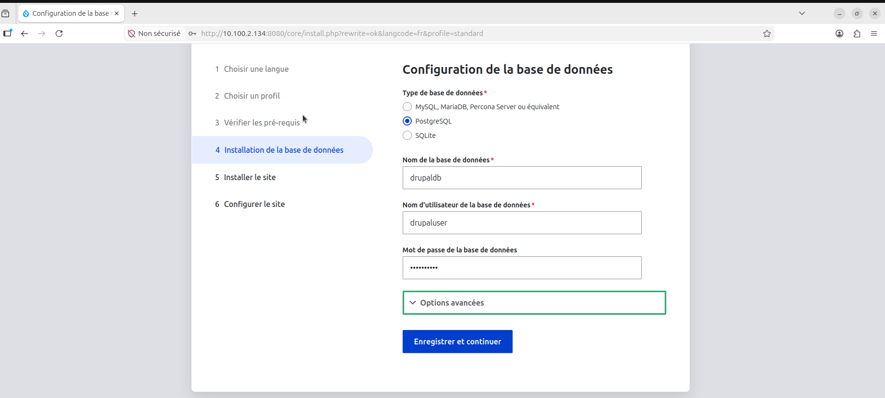
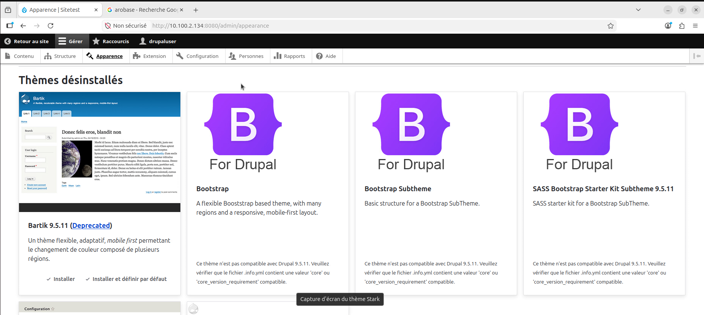

# ISS_TP2_Serge_Noah_2582510
# Travail pratique 2 - Docker

<br></br>
### But du travail : Dans ce travail pratique, nous allons démontrer que nous avons installé un système de conteneurs et que nous sommes capable de créer des conteneurs selon une description.

Principalement, nous allez faire :

l'installation d'un système de conteneur en respectant la procédure et les recommandations du manufacturier au besoin;
configurer le système de conteneurs en fonction d’une utilisation sécuritaire;
vérifier que les éléments installés fonctionnent comme prévu;
configurer des règles de gestions des accès sécuritaires.
<br></br>


# Section 2 : Construction personnalisée d'une image
## Étape 0: CRÉER STRUCTURE PROJET
####  Entrez les commandes suivantes sur votre serveur : 
```bash
mkdir -p mon_drupal/drupal
cd mon_drupal
```
## Étape 1: CRÉER Dockerfile
Nous allez créer un Dockerfile pour avoir une image drupal personnalisée dans votre dossier drupal
####  Entrez les commandes suivantes sur votre serveur : 

```bash
nano drupal/Dockerfile
```
- Nous allons créer un fichier Dockerfile qui utilise l’image de drupal 9, FROM drupal:9.
- Nous devons exécuter (RUN) apt pour installer git, apt update && apt install -y git.
- Nous devons faire un peu de nettoyage après l’installation avec la commande rm -rf /var/lib/apt/lists/*. 
- Par la suite, nous allons changer de répertoire, WORKDIR /var/www/html/themes.
- Nous allons exécuter la commande git clone --branch 5.0.x --single-branch --depth 1 https://git.drupalcode.org/project/bootstrap.git, pour installer le thème Bootstrap. nous allons également changer le propriétaire des fichiers copiés, chown -R www-data:www-data bootstrap. 
- Finalement, nous allons changer pour le répertoire /var/www/html.


```bash
FROM drupal:9

RUN apt update && apt install -y git \
    && rm -rf /var/lib/apt/lists/*

WORKDIR /var/www/html/themes

RUN git clone --branch 5.0.x --single-branch --depth 1 https://git.drupalcode.org/project/bootstrap.git \
    && chown -R www-data:www-data bootstrap

WORKDIR /var/www/html
```

<details>
    <summary> <strong>Detail image :</strong></summary>
  
</details>

## Étape 2 : BUILD IMAGE

#### Commande :
```bash
docker build -t drupal_custom ./drupal
```
<details>
    <summary> <strong>Detail image :</strong></summary>
  
</details>


## Étape 2 : POSTGRESQL POUR DRUPAL

<strong>Objectifs:</strong>

Nous allons créer un conteneur Postgresql pour l'utiliser avec Drupal:
- Nous devons exposer Drupal sur le port 8080 afin que nous puissions utiliser un navigateur avec localhost:8080.
- Lancer les conteneurs et configurez l'installation Web de Drupal à http://localhost:8080.
- Au choix de la BD, nous utiliserons PostgreSQL avec le nom de BD avec l’utilisateur et le mot de passe que nous avons configuré au lancement du conteneur.

#### Commande :

```bash
docker volume create drupal-data
```
<details>
    <summary> <strong>Detail image :</strong></summary>
  
</details>

#### Commande pour lancer PostgreSQL :

Nous avons remplacé l’image postgres:latest par postgres:15 afin d’éviter des incompatibilités liées aux changements récents de structure des données dans les nouvelles versions de PostgreSQL.
L’utilisation d’une version fixe garantit la stabilité, la compatibilité avec le volume Docker et le bon fonctionnement de Drupal.


```bash
docker run -d \
--name postgres \
--network mon_reseau \
-e POSTGRES_DB=drupaldb \
-e POSTGRES_USER=drupaluser \
-e POSTGRES_PASSWORD=drupalpass \
-v drupal-data:/var/lib/postgresql/data \
postgres:15
```


#### Commande pour lancer DRUPAL

```bash
docker run -d \
--name drupal \
--network mon_reseau \
-p 8080:80 \
drupal:9
```

<details>
    <summary> <strong>Detail image :</strong></summary>
   
</details>

#### Commande pour identifier l'adresse ip du server

```bash
ip a
```

<details>
    <summary> <strong>Detail image :</strong></summary>
  
</details>

#### Connexion sur le port 8080 sur la machine cliente ubuntu:

<details>
    <summary> <strong>Detail image :</strong></summary>
  
</details>

#### Configuration PostgreSQL

Informations :
 - Database name : drupaldb
 - Username : drupaluser
 - Password : drupalpass

<details>
    <summary> <strong>Detail image :</strong></summary>
  
    
</details>


