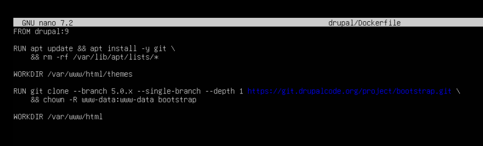
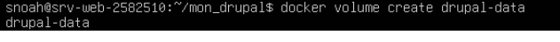

# ISS_TP2_Serge_Noah_2582510
# Travail pratique 2 - Docker

<br></br>
### But du travail : Dans ce travail pratique, nous allons démontrer que nous avons installé un système de conteneurs et que nous sommes capable de créer des conteneurs selon une description.

Principalement, nous allez faire :

l'installation d'un système de conteneur en respectant la procédure et les recommandations du manufacturier au besoin;
configurer le système de conteneurs en fonction d’une utilisation sécuritaire;
vérifier que les éléments installés fonctionnent comme prévu;
configurer des règles de gestions des accès sécuritaires.
<br></br>


# Section 2 : Construction personnalisée d'une image
## Étape 0: CRÉER STRUCTURE PROJET
####  Entrez les commandes suivantes sur votre serveur : 
```bash
mkdir -p mon_drupal/drupal
cd mon_drupal
```
## Étape 1: CRÉER Dockerfile
Nous allez créer un Dockerfile pour avoir une image drupal personnalisée dans votre dossier drupal
####  Entrez les commandes suivantes sur votre serveur : 

```bash
nano drupal/Dockerfile
```
- Nous allons créer un fichier Dockerfile qui utilise l’image de drupal 9, FROM drupal:9.
- Nous devons exécuter (RUN) apt pour installer git, apt update && apt install -y git.
- Nous devons faire un peu de nettoyage après l’installation avec la commande rm -rf /var/lib/apt/lists/*. 
- Par la suite, nous allons changer de répertoire, WORKDIR /var/www/html/themes.
- Nous allons exécuter la commande git clone --branch 5.0.x --single-branch --depth 1 https://git.drupalcode.org/project/bootstrap.git, pour installer le thème Bootstrap. nous allons également changer le propriétaire des fichiers copiés, chown -R www-data:www-data bootstrap. 
- Finalement, nous allons changer pour le répertoire /var/www/html.


```bash
FROM drupal:9

RUN apt update && apt install -y git \
    && rm -rf /var/lib/apt/lists/*

WORKDIR /var/www/html/themes

RUN git clone --branch 5.0.x --single-branch --depth 1 https://git.drupalcode.org/project/bootstrap.git \
    && chown -R www-data:www-data bootstrap

WORKDIR /var/www/html
```

<details>
    <summary> <strong>Detail image :</strong></summary>
  
</details>


## Étape 2 : POSTGRESQL POUR DRUPAL

<strong>Objectifs:</strong>

Nous allons créer un conteneur Postgresql pour l'utiliser avec Drupal:
- Nous devons exposer Drupal sur le port 8080 afin que nous puissions utiliser un navigateur avec localhost:8080.
- Lancer les conteneurs et configurez l'installation Web de Drupal à http://localhost:8080.
- Au choix de la BD, nous utiliserons PostgreSQL avec le nom de BD avec l’utilisateur et le mot de passe que nous avons configuré au lancement du conteneur.

#### Commande pour créer le réseau privé

```bash
docker network create mon_reseau
```
<details>
    <summary> <strong>Detail image :</strong></summary>
  
</details>

#### Commande pour créer le volume MongoDB

```bash
docker volume create mongodb
```

<details>
    <summary> <strong>Detail image :</strong></summary>
  
</details>

#### Commande pour lancer MongoDB

```bash
docker run -d \
--name mongodb \
--network mon_reseau \
-e MONGO_INITDB_ROOT_USERNAME=adminmongo \
-e MONGO_INITDB_ROOT_PASSWORD=EncoreUneAutreBD \
-v mongodb:/data/db \
mongodb/mongodb-community-server:latest
```

<details>
    <summary> <strong>Detail image :</strong></summary>
  
</details>

#### Commande pour lancer APACHE(HTTPD)

```bash
docker run -d \
--name apache \
--network mon_reseau \
-p 80:80 \
httpd:latest
```

<details>
    <summary> <strong>Detail image :</strong></summary>
  
</details>

#### Commande pour vérifier le réseau :

```bash
docker network inspect mon_reseau
```

<details>
    <summary> <strong>Detail image :</strong></summary>
  
</details>

#### Commande pour vérifier les logs Apache :

```bash
docker logs apache
```

<details>
    <summary> <strong>Detail image :</strong></summary>
  
</details>

